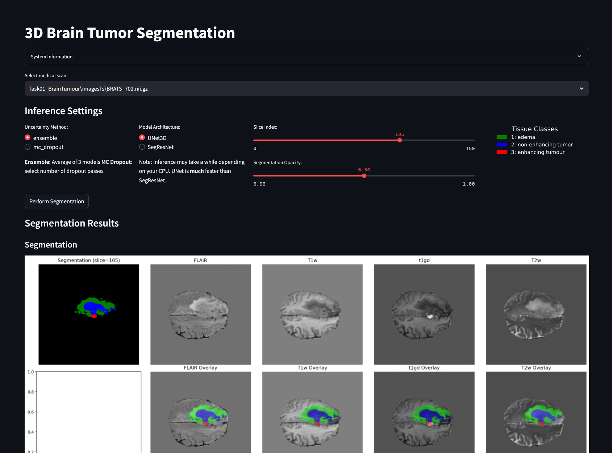

# 3D Brain Tumor Segmentation with Uncertainty Estimation

Training and inference webapp for 3d segmentation using Unet and SegResNet.



## Project Overview
A deep learning app for 3D brain tumor segmentation with uncertainty estimation using:
- **Two model architectures**: 3D U-Net and SegResNet
- **Uncertainty quantification**: Ensemble methods and Monte Carlo Dropout
- **Interactive visualization**: Streamlit web interface with multi-modal slice viewing

## Key Features
- 🧠 **Multi-model architecture support**
  - UNet3D with 5-level depth
  - SegResNet with residual blocks
- 🎲 **Uncertainty estimation methods**
  - Model ensemble (3 trained models)
  - MC Dropout with configurable passes
- 🖥️ **Interactive visualization**
  - Slice-by-slice navigation
  - Cached results for quicker loading times
  - Overlay opacity control
  - Uncertainty/Entropy heatmaps
- 🏥 **Medical image support**
  - NIfTI format handling
  - 4 MRI modalities (FLAIR, T1, T1ce, T2)
  - 3 tumor sub-region segmentation

## Installation
```bash
# Clone repository
git clone https://github.com/sallsdagrate/3d_brain_segmentation_tool.git
cd 3d_brain_segmentation_tool

# Install dependencies (recommended to set up a virtual environment first)
pip install -r requirements.txt

# Download dataset (recommended but not required. train.py and app.py downloads it for you)
wget "https://msd-for-monai.s3-us-west-2.amazonaws.com/Task01_BrainTumour.tar"
```

## Usage

### Run webapp
```bash
streamlit run app.py
```
#### Interface Controls
- Model Selection: UNet3D vs SegResNet
- Uncertainty Method: Ensemble vs MC Dropout
- Slice Navigator: 3D volume exploration
- Overlay Opacity: 0-100% segmentation visibility

#### Output Visualizations
- Primary Segmentation
- Prediction Uncertainty (Std Dev)
- Information Entropy Map


### Train models
```bash
# Train UNet3D (default)
python train.py --model unet3d

# Train SegResNet
python train.py --model segresnet
```
If you train new models and want to use them in the webapp make sure to update the model paths in `utils/app_utils.py`.

#### Optimization Strategy

- Loss: Multi-class Dice Loss
- Optimizer: Adam (lr=1e-3)
- Scheduling: Cosine annealing
- Augmentations:
  - 3D elastic deformations
  - Random flips/rotations
  - Intensity variations


## Directory Structure
```
sallsdagrate-hss_task/
├── app.py               # Streamlit application
├── train.py             # Training script
├── models/              # Pretrained model weights
│   ├── archive/         # Older model versions
│   ├── segresnet/       # SegResNet checkpoints
│   └── unet3d/          # UNet3D checkpoints
├── utils/               # Core functionality
│   ├── BrainTumourDataset.py  # Data loading
│   ├── app_utils.py     # Visualization/inference
│   └── config.py        # Hyperparameters & paths
└── requirements.txt     # Python dependencies
```


## Configuration

Key parameters in `utils/config.py`:
```python
# Data paths
DATA_ROOT = Path('Task01_BrainTumour')
DATASET_LINK_AWS = 'https://msd-for-monai.s3-us-west-2.amazonaws.com/...'

# Training params
batch_size = 2           # Limited by GPU memory
num_workers = 8          # Data loading threads
testVsTrainSplit = 0.2   # Validation split

# Model architectures
UNet3D = (16, 32, 64, 128, 256)  # Channel progression
SegResNet = (8, [1,2,2], [1,1])  # Init filters, down/up blocks
```
Update the model architectures in their respective getter functions.

